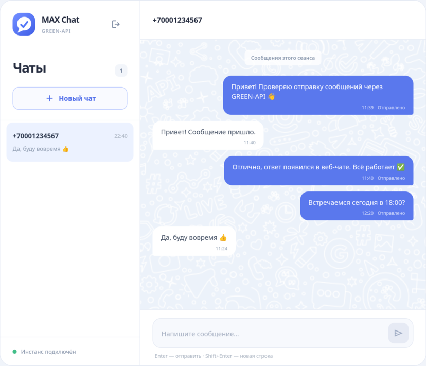

# MAX Chat

Тестовое задание на должность - Фронтенд разработчик React для GREEN-API: интерфейс для отправки и получения текстовых сообщений в мессенджере MAX.

Демо доступно по адресу - https://belonit.github.io/green-api-test-task



## Локальный запуск

Требуется Node.js 22.18 или новее.

```bash
git clone https://github.com/Belonit/green-api-test-task.git
cd green-api-test-task

npm ci
npm run dev
```

После запуска приложение будет доступно по адресу <http://localhost:5173>.

Для подключения потребуются адрес API, ID инстанса и API-токен из [личного кабинета GREEN-API](https://console.green-api.com/auth).

## Возможности

- подключение MAX-инстанса GREEN-API с помощью адреса API, ID и API-токена
- создание чата по номеру телефона
- отправка и получение текстовых сообщений
- несколько чатов, черновики и счётчики непрочитанных сообщений
- отображение статуса отправки и ошибок API
- проверка и включение входящих уведомлений
- отслеживание состояния подключения и автоматическое восстановление получения сообщений после временных ошибок
- адаптивный интерфейс для компьютеров и мобильных устройств

## Осознанные ограничения

По условиям тестового задания интерфейс должен содержать минимальный набор функций. Поэтому дополнительные возможности, не требующиеся для основного сценария отправки и получения текстовых сообщений, намеренно не реализованы, а некоторые редкие сценарии упрощены:

- поддерживаются только личные текстовые сообщения, без групп, файлов, стикеров и голосовых сообщений
- новый чат можно создать только по номеру РФ или РБ
- история не загружается из MAX, а данные подключения, чаты и сообщения хранятся только до обновления страницы или отключения
- имена и аватары контактов не загружаются, вместо них отображаются номера телефонов
- звуковые оповещения о новых сообщениях не реализованы
- отображаются статусы отправки в GREEN-API и ошибки, но не доставка и прочтение получателем
- редактирование и удаление сообщений не реализованы
- работа нескольких вкладок или клиентов с одним инстансом не координируется, поэтому уведомление может быть обработано другим клиентом и не появиться в текущей вкладке
- при потере ответа на отправку результат остаётся неопределённым, автоматическая повторная отправка не выполняется

## Используемые методы GREEN-API

- [GetStateInstance](https://green-api.com/v3/docs/api/account/GetStateInstance/) - проверка состояния инстанса
- [GetSettings](https://green-api.com/v3/docs/api/account/GetSettings/) - получение настроек инстанса
- [SetSettings](https://green-api.com/v3/docs/api/account/SetSettings/) - включение входящих уведомлений
- [CheckAccount](https://green-api.com/v3/docs/api/service/CheckAccount/) - проверка номера и получение идентификатора чата
- [SendMessage](https://green-api.com/v3/docs/api/sending/SendMessage/) - отправка сообщения
- [ReceiveNotification](https://green-api.com/v3/docs/api/receiving/technology-http-api/ReceiveNotification/) - получение уведомления
- [DeleteNotification](https://green-api.com/v3/docs/api/receiving/technology-http-api/DeleteNotification/) - подтверждение обработки уведомления

## Используемые технологии

- React - пользовательский интерфейс и управление состоянием
- TypeScript - статическая типизация
- Vite - разработка и сборка приложения
- Zod - проверка пользовательского ввода и ответов API
- i18next - локализация интерфейса
- Google Fonts - подключение Noto Sans и Noto Color Emoji
- vite-plugin-svgr - импорт SVG-иконок как React-компонентов
- CSpell - проверка орфографии в проекте
- Oxlint и Oxfmt - проверка и форматирование кода
